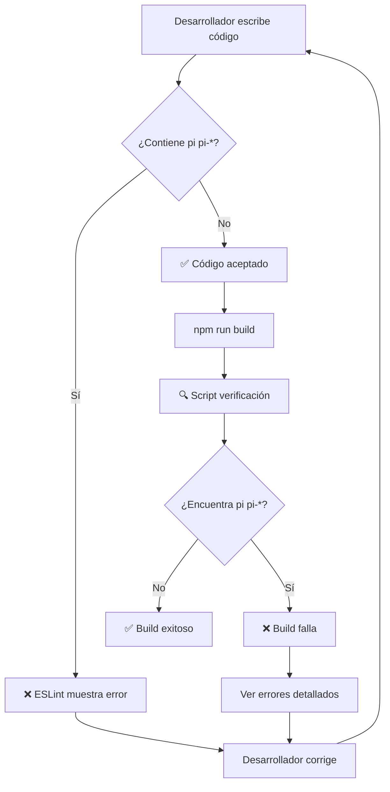

# 🛡️ Sistema de Protección contra Íconos PrimeVue

## 📋 **Objetivo**

Garantizar que **NUNCA** se introduzcan íconos de PrimeVue (`pi pi-*`) en el proyecto, manteniendo exclusivamente íconos de **Lucide**.

---

## 🔧 **Sistemas de Protección Implementados**

### 1. **ESLint - Regla Personalizada** (.eslintrc.cjs)

```javascript
'no-restricted-syntax': [
  'error',
  {
    'selector': 'Literal[value=/pi pi-/]',
    'message': '🚫 NO usar íconos PrimeVue "pi pi-*". Usa íconos de Lucide en su lugar.'
  },
  {
    'selector': 'TemplateElement[value.raw=/pi pi-/]',
    'message': '🚫 NO usar íconos PrimeVue "pi pi-*" en templates. Usa íconos de Lucide en su lugar.'
  }
]
```

### 2. **Script de Verificación** (scripts/check-primeicons.cjs)

- 🔍 **Busca** el patrón `pi pi-` en todos los archivos `.vue`
- 📍 **Muestra** archivo, línea y contenido exacto
- ❌ **Falla** el build si encuentra alguna ocurrencia
- 💡 **Proporciona** soluciones y ejemplos

### 3. **Pre-build Hook** (package.json)

```json
"prebuild": "npm run check-primeicons"
```

- ✅ Se ejecuta **automáticamente** antes de cada build
- 🚫 **Bloquea** el build si hay íconos PrimeVue

---

## 🚀 **Comandos Disponibles**

### Verificar íconos manualmente:

```bash
npm run check-primeicons
# o
pnpm run check-primeicons
```

### Build (incluye verificación automática):

```bash
npm run build
# o
pnpm run build
```

---

## ✅ **Estado Actual del Proyecto**

```
🔍 Verificando íconos PrimeVue...

✅ ¡Perfecto! No se encontraron íconos PrimeVue "pi pi-*"
🎯 Todos los íconos son de Lucide como debería ser.
```

---

## 🎯 **¿Cómo usar íconos correctamente?**

### ❌ **INCORRECTO** (PrimeVue):

```vue
<!-- NO hacer esto -->
<Button icon="pi pi-home" />
<i class="pi pi-user"></i>
```

### ✅ **CORRECTO** (Lucide):

```vue
<script setup>
import { Home, User } from "lucide-vue-next";
</script>

<template>
  <!-- Para botones PrimeVue -->
  <Button>
    <template #icon>
      <Home class="w-4 h-4" />
    </template>
  </Button>

  <!-- Para uso directo -->
  <User class="w-5 h-5 text-gray-600" />
</template>
```

---

## 🛡️ **¿Qué pasa si alguien intenta agregar íconos PrimeVue?**

### Al hacer `npm run build`:

```
🚫 ¡ERRORES ENCONTRADOS! Se detectaron íconos PrimeVue:

📁 src/components/MiComponente.vue:
   ❌ Línea 15: <Button icon="pi pi-home" />
      └─ Encontrado: "pi pi-"

💡 SOLUCIÓN:
   1. Reemplaza los íconos "pi pi-*" con íconos de Lucide
   2. Importa el ícono de lucide-vue-next
   3. Usa <template #icon><LucideIcon /></template> en botones
   4. Usa <LucideIcon /> directamente en otros lugares

📚 Ejemplo:
   ❌ icon="pi pi-home"
   ✅ <template #icon><Home class="w-4 h-4" /></template>
```

### Con ESLint en el editor:

- 🔴 **Error en tiempo real** con mensaje explicativo
- 💡 **Sugerencias** de cómo corregirlo

---

## 🔄 **Flujo de Protección**



---

## 💡 **Beneficios del Sistema**

- 🛡️ **Prevención automática** de regresiones
- 🎯 **Consistencia** en el uso de íconos
- 📚 **Educación** de desarrolladores con ejemplos
- ⚡ **Detección temprana** en desarrollo
- 🚫 **Bloqueo** en build/deploy

---

## 🏆 **Resultado**

**CERO posibilidades** de que se introduzcan accidentalmente íconos PrimeVue en el proyecto. El sistema garantiza que **solo** se usen íconos de Lucide.
